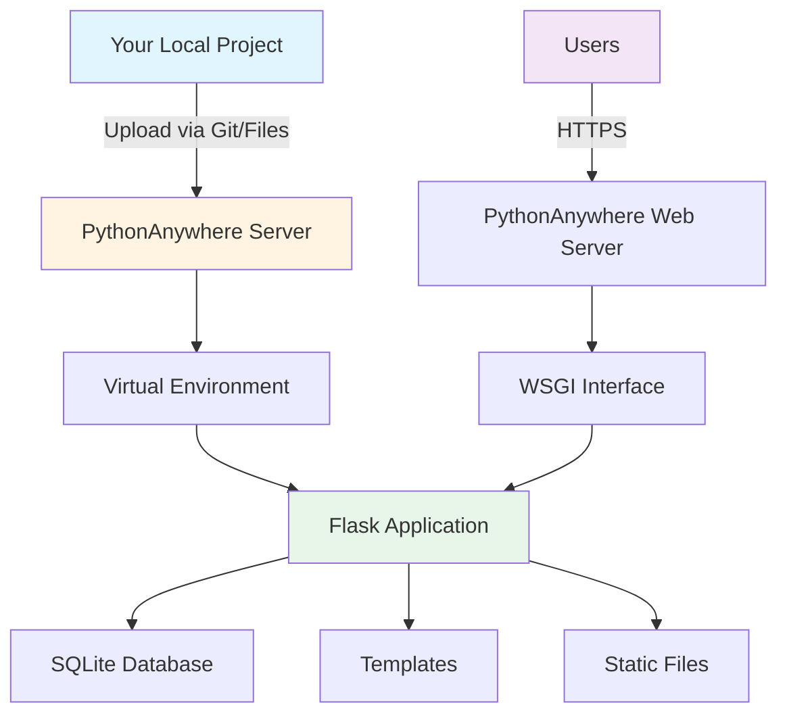
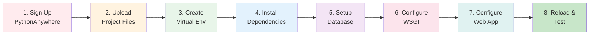
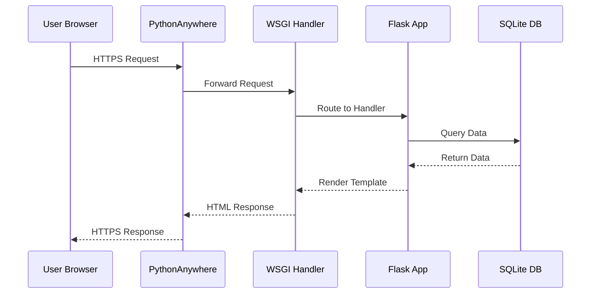
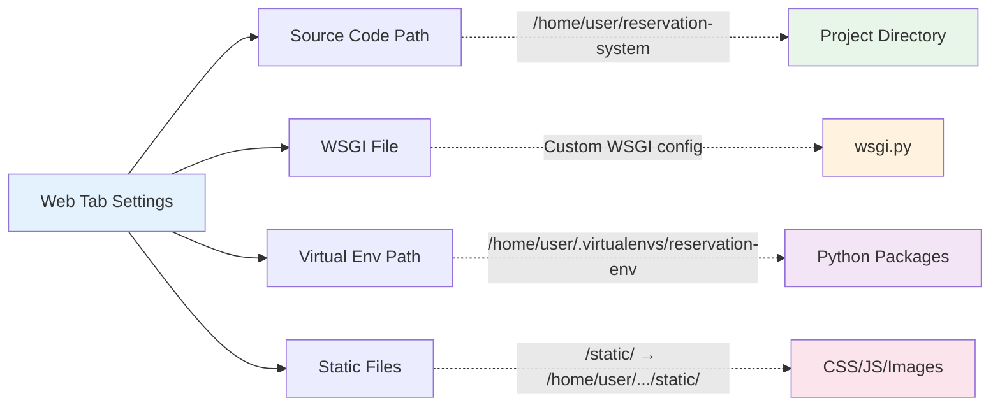
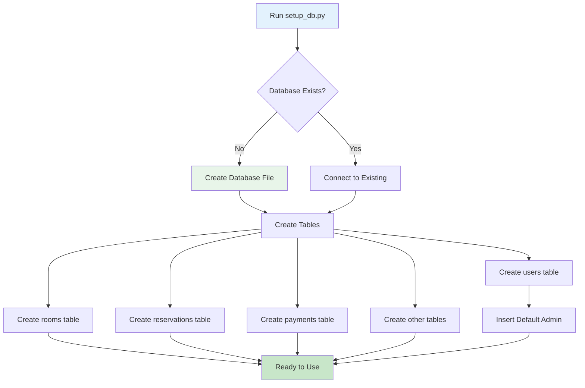
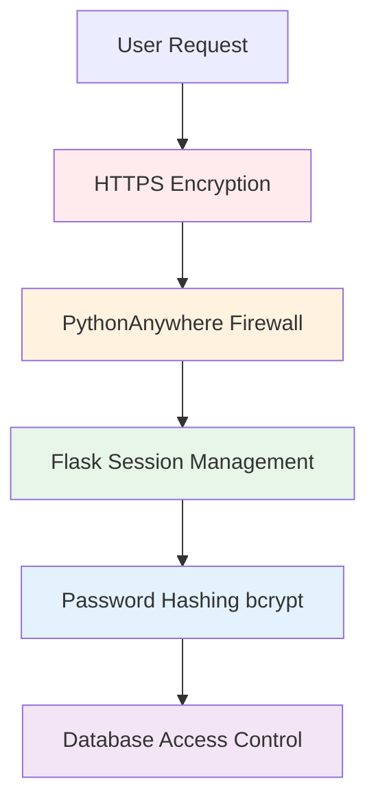
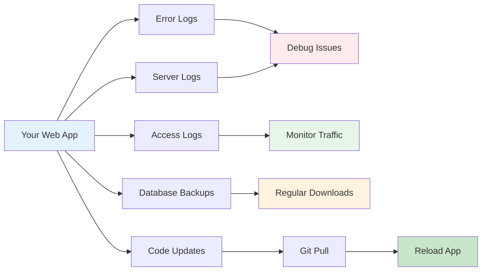
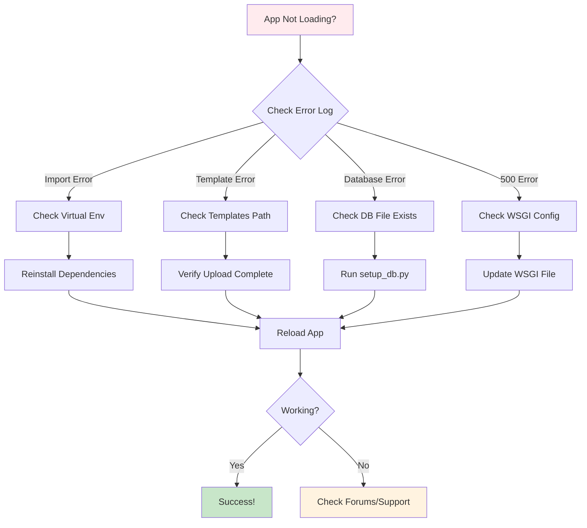

# PythonAnywhere Deployment Architecture

## System Overview



## Deployment Flow



## File Structure on PythonAnywhere

```
/home/yourusername/
├── .virtualenvs/
│   └── reservation-env/          # Virtual environment
│       └── lib/
│           └── python3.10/
│               └── site-packages/ # Installed packages
│
└── reservation-system/            # Your project
    ├── app.py                     # Main Flask app
    ├── Reservations.py            # Database functions
    ├── requirements.txt           # Dependencies
    ├── setup_db.py                # DB initialization
    ├── reservation_system.db      # SQLite database
    │
    ├── templates/                 # HTML templates
    │   ├── login.html
    │   ├── register.html
    │   ├── patron/
    │   │   ├── dashboard.html
    │   │   ├── booking.html
    │   │   └── ...
    │   └── admin/
    │       ├── dashboard.html
    │       └── ...
    │
    └── static/                    # Static files
        ├── css/
        ├── js/
        └── images/
```

## Request Flow



## Web App Configuration



## Database Setup Process



## Security Layers



## Monitoring & Maintenance



## Troubleshooting Decision Tree



---

## Key URLs After Deployment

| Resource | URL Pattern |
|----------|-------------|
| **Your Web App** | `https://yourusername.pythonanywhere.com` |
| **Admin Login** | `https://yourusername.pythonanywhere.com/login` |
| **Files Manager** | `https://www.pythonanywhere.com/user/yourusername/files/` |
| **Web Config** | `https://www.pythonanywhere.com/user/yourusername/webapps/` |
| **Consoles** | `https://www.pythonanywhere.com/user/yourusername/consoles/` |

---

## Quick Commands Reference

### On PythonAnywhere Bash Console

```bash
# Navigate to project
cd ~/reservation-system

# Activate virtual environment
workon reservation-env

# Install/Update dependencies
pip install -r requirements.txt

# Initialize database
python setup_db.py

# Check database
python check_db.py

# View error logs
tail -f /var/log/yourusername.pythonanywhere.com.error.log

# Reload web app (alternative to Web tab)
touch /var/www/yourusername_pythonanywhere_com_wsgi.py
```

### Local Development

```bash
# Test locally before deploying
cd /Applications/XAMPP/xamppfiles/htdocs/CLIENT_PROJECT/reservation_booking_system_f
python app.py

# Access at: http://localhost:5002
```

---

This visual guide complements the detailed deployment guide in `PYTHONANYWHERE_DEPLOYMENT_GUIDE.md`.
